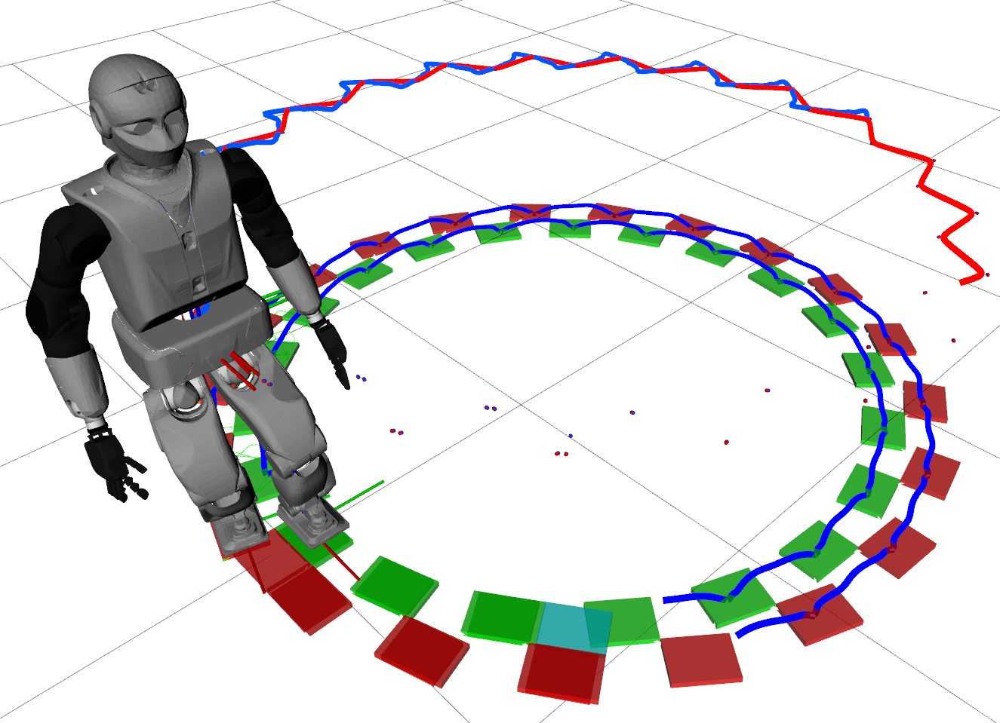
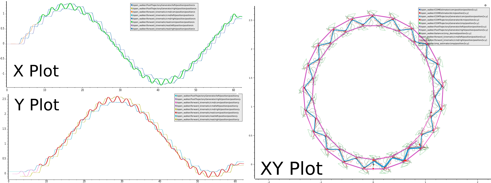

# [OpenWalker](https://github.com/TUM-ICS/openwalker_demo)



[](https://ics-robotics.github.io/ow_docs/doxy/html/index.html)
[](https://github.com/TUM-ICS/openwalker_demo/blob/main/LICENSE)
[](https://github.com/TUM-ICS/ow_docker/pkgs/container/ow_docker)

The **OpenWalker Project** aims to fulfill the need for a standard walking controller architecture providing the minimal components required to generate stable walking on biped robots with planar feet. The project is based on [ros_control](http://wiki.ros.org/ros_control) and provides modules and templates for fast prototyping of balancing/walking controller components. 

A description of all implemented algorithms and modules is available in the [online documentation](https://ics-robotics.github.io/ow_docs/doxy/html/index.html).

https://github.com/user-attachments/assets/06298efd-9874-4d7f-9132-65cdcc7e03e7

https://github.com/user-attachments/assets/90bb2a4c-2b83-4cfc-b2d0-f711a1de4dec

## Install (Docker)

We release a [Docker image](https://github.com/TUM-ICS/ow_docker/pkgs/container/ow_docker) that can directly be used with [VS Code Dev Containers](https://code.visualstudio.com/docs/devcontainers/tutorial) to develop and run the project.

### Requirements

- [Docker](https://docs.docker.com/engine/install/ubuntu/)
- [Nvidia-container-toolkit](https://docs.nvidia.com/datacenter/cloud-native/container-toolkit/latest/install-guide.html)
- [VS Code Dev Containers](https://code.visualstudio.com/docs/devcontainers/tutorial)

### 1. Pull the image

```bash
docker pull ghcr.io/tum-ics/ow_docker:melodic-reemc-devel-vscode
```

### 2. Clone this repository and start the [devcontainer](https://code.visualstudio.com/docs/devcontainers/tutorial)

If the nvidia-container-toolkit is not used, edit [devcontainer.json](.devcontainer/devcontainer.json) and remove ```--runtime=nvidia```

```bash
git clone --recursive https://github.com/TUM-ICS/openwalker.git
cd openwalker && code .
```

### 3. Build the workspace inside the devcontainer

```bash
source /opt/pal/setup.bash
catkin build -DCATKIN_ENABLE_TESTING=0 -DCMAKE_BUILD_TYPE=Release
```

## Install (Manual)

Alternatively, the project can also be installed on an Ubuntu 18.04 machine. 

### Requirements

- Ubuntu 18.04 / [Ros Melodic](http://wiki.ros.org/melodic/Installation)
- Compiler supporting C++11


### 1. Clone this repository and set up the ROS environment.

```bash
git clone --recursive https://github.com/TUM-ICS/openwalker.git
cd openwalker && source /opt/ros/melodic/setup.bash
```

### 2. Install the required build tools.

```bash
./doc/install/install.sh
```

### 3. Populate the workspace with the REEM-C packages.

```bash
rosinstall src/reemc /opt/ros/melodic doc/install/melodic.rosinstall
```

### 4. Install the required dependencies.

```bash
sudo rosdep init
rosdep update
rosdep install --from-paths src --ignore-src --rosdistro melodic -y --skip-keys="opencv2 pal_laser_filters speed_limit_node sensor_to_cloud hokuyo_node libdw-dev gmock walking_utils rqt_current_limit_controller simple_grasping_action reemc_init_offset_controller walking_controller"
```

### 5. Build the workspace.

```bash
catkin build -DCATKIN_ENABLE_TESTING=0 -DCMAKE_BUILD_TYPE=Release
```

## Run

The following demo generates dynamic walking for the humanoid robot [REEM-C](http://wiki.ros.org/Robots/REEM-C) of PAL Robotics.
It uses [Gazebo](http://gazebosim.org/) for the physics simulation and [Rviz](http://wiki.ros.org/rviz) for visualization.
The robot can execute predefined foot-step plans or be controlled with a joystick by a user.

For Docker users, this [readme](https://github.com/TUM-ICS/ow_docker/blob/main/README.md#access-vscode-dev-container-outside-vscode) describes how to connect terminals with the container.

### 1. Launch the simulation.

```bash
source devel/setup.bash
roslaunch ow_reemc gazebo.launch
```

### 2. Run the controller.

```bash
source devel/setup.bash
roslaunch ow_reemc sim.launch
```

### 3. Call one of the following services to start walking.

```bash
source devel/setup.bash

# Step in place.
rosservice call /open_walker/plan_fixed_stamp

# Walk in a straight line.
rosservice call /open_walker/plan_fixed_line

# Walk to the side
rosservice call /open_walker/plan_fixed_sidestep_left
rosservice call /open_walker/plan_fixed_sidestep_right

# Walk in circles.
rosservice call /open_walker/plan_fixed_circle_right
rosservice call /open_walker/plan_fixed_circle_left

# Generic plan with 20 steps of 0.2 m length and 0.1 rad angle 
rosservice call /open_walker/plan_fixed "n_steps:
  data: 20
length:
  data: 0.2 
lateral:
  data: 0.0
angle:
  data: 0.1"
```




# Credits

OpenWalker was developed by Emmanuel Dean, Florian Bergner, Rogelio Guadarrama-Olvera, Simon Armleder, and Gordon Cheng from the [Institute for Cognitive Systems (ICS)](https://www.ce.cit.tum.de/ics/home/), Technical University of Munich, Germany.

# Acknowledgement

This project has received funding from the European Union‘s Horizon 2020 research and innovation programme under grant agreement No 732287.
